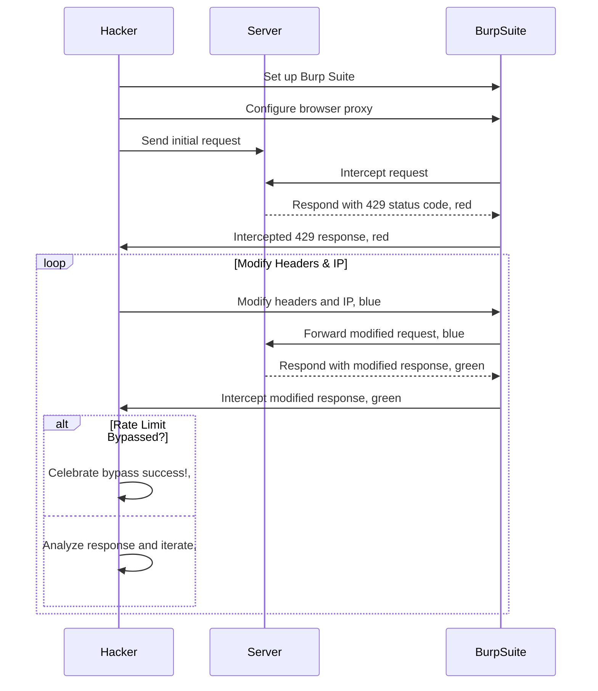

# Bug Bounty Methodology: HTTP Rate Limit Bypass


## Introduction

Hey there, fellow bug bounty hunters! Today, we're going to explore a fun and sneaky bug bounty methodology that involves bypassing those  HTTP rate limits. We'll learn how to outsmart the servers by adding some secret headers and playing around with IP addresses. So grab your Burp Suite and get ready for some ninja moves!

## Background

Rate limiting is like a security guard for servers, trying to prevent abuse and excessive requests. When you cross the line, the server slaps you with a `429` HTTP status code, saying, "Whoa there, buddy, too many requests!" But guess what? We can find ways to dance around those limits.



## Bypass Techniques

To outsmart rate limiting, we'll use some clever headers that let us pretend to be different clients with fancy IP addresses. Here are the secret headers we'll play with:

1.  `X-Forwarded-For`: Modify this header to include a different IP address for each request. It's like wearing different disguises.

2.  `X-Originating-IP`: Change the IP address in this header to make it appear as if the request is coming from a different source. We're masters of deception!

3.  `X-Remote-Addr`: Set this header to a different IP address for each subsequent request. It's like teleporting to a new location every time!

4.  `X-Remote-IP`: Modify this header to specify a unique IP address for each request. We're like chameleons, blending into our surroundings!

5.  `X-Client-IP`: Alter the IP address in this header to present yourself as a different client. We're shape-shifters!

6.  `X-Forwarded`: Manipulate this header to send the request to a different dimension, metaphorically speaking. We're bending the rules of space and time!

7.  `X-Forwarded-Host`: Change the host specified in this header to trick the server into believing it's a different request. We're pulling off illusions!

8.  `X-Host`: Modify this header to present a different host IP address. We're the masters of disguise!

9.  `X-Forwarded-Server`: Use

 this header to specify a different server IP address. We're playing tricks on the server!

10.  `X-Real-IP`: Play with this header to show off your real (fake) IP address. We're like magicians, revealing the unreal!

## Performing the Test using Burp Suite

Now it's time to unleash the power of Burp Suite, our trusty ally in the bug bounty hunt. Follow these steps to perform the rate limit bypass test:

1.  **Set up Burp Suite**: Download and install [Burp Suite](https://portswigger.net/burp) on your system. Make your browser use Burp Suite as a proxy. Burp Suite is our ninja gear!

2.  **Intercept the request**: Launch Burp Suite, go to the target application, and intercept the request you want to test. Just click on "Proxy" -> "Intercept," and make sure the "Intercept is on" button is enabled. We're ready to strike!

3.  **Modify the headers**: In the "Intercept" tab of Burp Suite, find the request headers and add the secret bypass headers we learned earlier. Change the IP address in the header value to a different IP for each subsequent request. We're pulling off the header heist!

    Example:

    <br>
    
    ```
    GET /path/to/resource HTTP/1.1
    Host: example.com
    X-Forwarded-For: 192.168.0.1
    ```
    
4.  **Forward the modified request**: After modifying the headers, click the "Forward" button in Burp Suite to send the modified request to the server. It's time to strike with our secret weapons!

5.  **Analyze the response**: Examine the server's response to see if we successfully bypassed the rate limiting. If the server doesn't respond with a 429 status code, it means we did it! We're the rate limit ninjas!

6.  **Repeat the process**: Keep going! Repeat steps 3 to 5, changing the IP address and headers for each subsequent request. Each attempt brings us closer to bypassing the rate limiting. We're persistent and clever!

> **Note:** The exact steps and appearance of Burp Suite may vary depending on the version you're using. Check out the Burp Suite documentation for detailed instructions.
{: .prompt-warning }


## Conclusion

Bypassing rate limiting is like a thrilling dance in the world of bug bounty hunting. With our secret headers and IP address tricks, we can attempt to outsmart the servers. But remember, be responsible and stay within legal and ethical boundaries. Happy bug hunting, my fellow ninjas!


