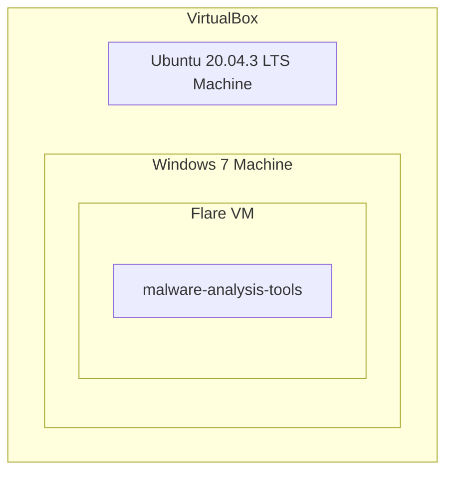

## Basic Architecture <br><br>

<br><br>





```mermaid
graph TD
  A[Malware Analysis Tools] --> B[IDA Pro]
  A --> C[Ghidra]
  A --> D[OllyDbg]
  A --> E[x64dbg]
  A --> F[Procmon]
  A --> G[Wireshark]
  A --> H[Volatility]
  A --> I[CAPE Sandbox]
  A --> J[Cuckoo Sandbox]
  A --> K[YARA]
  A --> L[PEStudio]
  A --> M[Sysinternals Suite]

  style A fill:#009688,stroke:#00695C,stroke-width:2px,color:#FFFFFF,font-weight:bold;
  style B fill:#FF9800,stroke:#E65100,stroke-width:2px,color:#000000,font-weight:bold;
  style C fill:#FF9800,stroke:#E65100,stroke-width:2px,color:#000000,font-weight:bold;
  style D fill:#FF9800,stroke:#E65100,stroke-width:2px,color:#000000,font-weight:bold;
  style E fill:#FF9800,stroke:#E65100,stroke-width:2px,color:#000000,font-weight:bold;
  style F fill:#FF9800,stroke:#E65100,stroke-width:2px,color:#000000,font-weight:bold;
  style G fill:#FF9800,stroke:#E65100,stroke-width:2px,color:#000000,font-weight:bold;
  style H fill:#FF9800,stroke:#E65100,stroke-width:2px,color:#000000,font-weight:bold;
  style I fill:#FF9800,stroke:#E65100,stroke-width:2px,color:#000000,font-weight:bold;
  style J fill:#FF9800,stroke:#E65100,stroke-width:2px,color:#000000,font-weight:bold;
  style K fill:#FF9800,stroke:#E65100,stroke-width:2px,color:#000000,font-weight:bold;
  style L fill:#FF9800,stroke:#E65100,stroke-width:2px,color:#000000,font-weight:bold;
  style M fill:#FF9800,stroke:#E65100,stroke-width:2px,color:#000000,font-weight:bold;




```

## 1 Install VirtualBox 📦

 VirtualBox is essential for setting up a malware analysis lab as it allows for the creation of isolated virtual environments, enabling safe and controlled execution of potentially harmful malware samples.

[Click here to Download Virtual Box](https://www.virtualbox.org/wiki/Downloads)

<br> <br>
## 2 Install the Operating System

Now that you have installed your virtualization software you need to install a **VM** to run the malware and install all the tools that you need.

I will install a Windows 7 32 bit machine.

[Windows 7 Home Premium SP1 (32-Bit)](https://archive.org/details/windows7homepremiumsp132bit)

> **Note:** Installation could be very slow  be patient
{: .prompt-tip }

<br><br>


<br><br>

 1. Now open VirtualBox click  **new.**
 2. Select Windows 7 32 bit and give a name to your VM.
 3. Then select the amount of RAM that you want to give to it. I suggest you to give 2500 MB of RAM.
 4.  For the next ones just leave that with the default settings.
 5. Now choose the amount of memory (ROM) that you want to give to the VM. I suggest you 40 GB of memory.

> Perfect! You have created your virtual machine.
{: .prompt-warning }

## 3 Crucial things to do after windows 7 installation
<br><br>


<br><br>
## 4 Flare VM Installation

Go to this repo https://github.com/mandiant/flare-vm
Download [install.ps1](https://github.com/mandiant/flare-vm/blob/main/install.ps1)  to the windows **VM**
  
Open that folder where you saved `install.ps1` and open the `powershell as an administrator`
Unblock the installation script by running:
```
Unblock-File .\install.ps1
```
Enable script execution by running:
```
Set-ExecutionPolicy Unrestricted
```

One Final Command to begin the flare-vm installation process 

```
.\install.ps1
```

To use the CLI-only mode with minimal user interaction:  
```
.\install.ps1 -password <password> -noWait -noGui -noCheck
```

> Now sit-back and relax for `3 Hours!!!.🤯`
{: .prompt-danger }
> If the installation prompts anything press y and hit enter approximately it will take almost 3 hours!!

<br><br><br>


## TooooLs

1.  [PeStudio](https://www.varonis.com/blog/malware-analysis-tools#PeStudio)
2.  [Process Hacker](https://www.varonis.com/blog/malware-analysis-tools#ProcessHacker)
3.  [Process Monitor (ProcMon)](https://www.varonis.com/blog/malware-analysis-tools#ProcMon)
4.  [ProcDot](https://www.varonis.com/blog/malware-analysis-tools#ProcDot)
5.  [Autoruns](https://www.varonis.com/blog/malware-analysis-tools#Autoruns)
6.  [Fiddler](https://www.varonis.com/blog/malware-analysis-tools#Fiddler)
7.  [Wireshark](https://www.varonis.com/blog/malware-analysis-tools#Wireshark)
8.  [x64dbg](https://www.varonis.com/blog/malware-analysis-tools#x64dbg)
9.  [Ghidra](https://www.varonis.com/blog/malware-analysis-tools#Ghidra)
10.  [Radare2/Cutter](https://www.varonis.com/blog/malware-analysis-tools#Cutter)
11.  [Cuckoo Sandbox](https://www.varonis.com/blog/malware-analysis-tools#Cuckoo)

[Learn in-details How to setup the lab here!!](https://app.letsdefend.io/training/lesson_detail/building-a-malware-analysis-lab)


