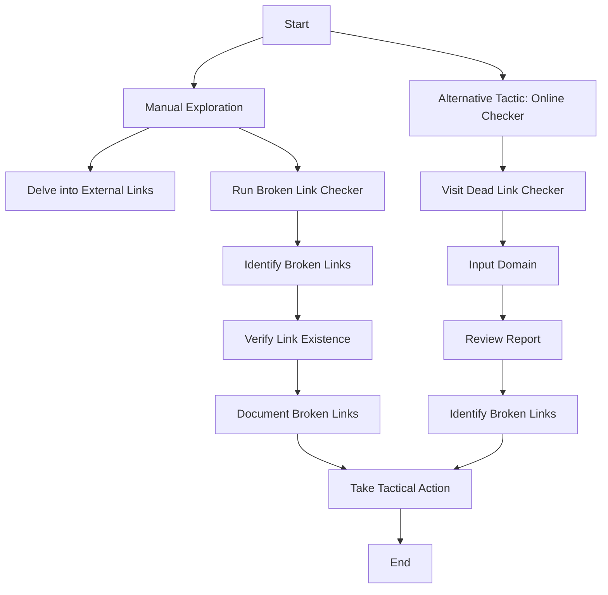

<h1 style="color: cyan; text-align: center">100 Day's Of Cybersecurity - Day 11</h1>

# Br0k3n L1nk Hij@ck1ng

## Introduction

In the realm of bug bounty hunting, uncovering vulnerabilities that may compromise a website's security is a thrilling challenge. One often-overlooked aspect is the presence of broken links, which could potentially lead to more severe issues. This technical guide will walk you through the process of identifying and reporting broken links on a target site, using a combination of manual investigation and automated tools.

## Manual Exploration and Broken Link Checker

### Step 1: Delving into External Links

As a bug bounty hunter, your initial reconnaissance involves manually exploring external links on the target website. These links could include social media accounts or media links. Simultaneously, initiate a background check using a broken link checker with the following command:

```bash
blc -rof --filter-level 3 https://example.com/
```

The output may expose broken links in the form of:

```plaintext
─BROKEN─ https://www.linkedin.com/company/ACME-inc-/ (HTTP_999)
```

### Step 2: Verification and Tactical Response

Upon discovering broken links, your next move is to verify if the linked page exists. If it's missing, this could be an opportunity to report the issue. Consider documenting the broken link and any potential impacts it may have. The goal is not only to identify vulnerabilities but also to suggest corrective actions to enhance the website's security.

## Alternative Tactic: Online Broken Link Checker

For bug bounty hunters seeking efficiency, leveraging online tools can be a game-changer. Platforms like Dead Link Checker offer a streamlined approach:

1. Visit [Dead Link Checker](https://www.deadlinkchecker.com/) or a similar service.
2. Input the domain name of the target site.
3. Review the generated report to pinpoint broken links.

This method allows you to quickly identify vulnerabilities without the need for extensive manual clicking.

## Visualizing the Hunt with Mind Maps

To gain a clearer perspective on the bug bounty hunting process, let's visualize it with a mind map:



This mind map offers bug bounty hunters a visual roadmap, emphasizing the strategic steps involved in identifying and reporting broken links.

## Conclusion

In the dynamic field of bug bounty hunting, recognizing and reporting broken links is more than just a technical pursuit—it's a crucial step in strengthening a website's security. Whether through manual exploration or online tools, taking a proactive stance contributes to the overall success of your bug bounty mission.


